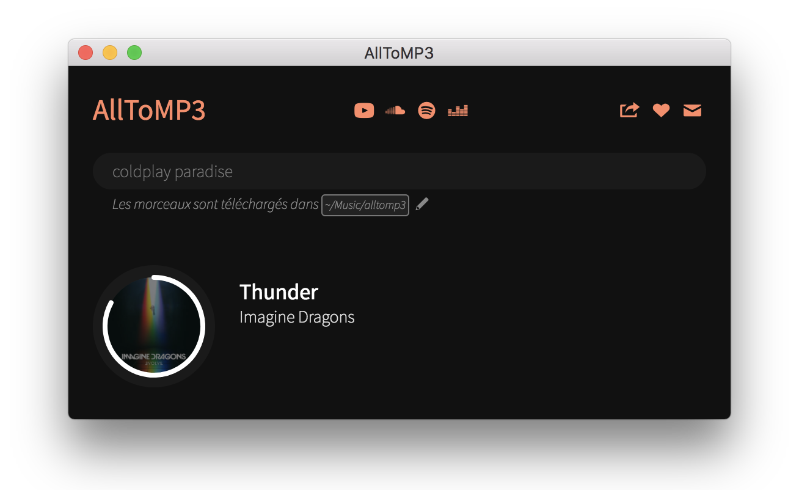

# AllToMP3 <a href="https://packagecloud.io/"></a>

[AllToMP3](https://alltomp3.org) is a desktop application to download and convert YouTube, SoundCloud, Spotify and Deezer in 256 kb/s MP3, **with tags: cover, title, artist, genre, and even lyrics!**.
It supports YouTube playlists, Deezer and Spotify playlists, and also integrate a search engine so you can simply specify a song name or an album and AllToMP3 will download it.

You can download AllToMP3 for Windows, macOS and Linux here: https://alltomp3.org

[](https://alltomp3.org)

## Windows Warning
If you have an antivirus, it may interfere with AllToMP3.
If you encounter any problem, try to add an exception for AllToMP3 or to deactivate it (https://github.com/AllToMP3/alltomp3-app/issues/67).

## For developers
### Installation
Install the following requirements:
- Node 10 + NPM;
- `npm install -g @angular/cli@1.0.0`

On Linux you will need [AllToMP3 requirements](https://github.com/AllToMP3/alltomp3#requirements) (ffmpeg, fpcalc, python)

Then install the dependencies:
```bash
cd app
npm install
cd ..
npm install
```

### Launching the app
Go in the `app/` folder and execute `ng serve`.
Then, in another terminal, in the main folder execute `npm start` (it allows hot-reload of the Angular part).

### Building the app
```
cd app/
./build.sh
cd ../
npm run dist
```
On macOS or Windows you will need a valid certificate so the application can be signed.

### Translating
You need basic knowledge of programming and using Github to create a new translation.
Also you need to know two letter country code for language (for example finnish `FI`).

1. Fork this repository;
1. Duplicate some file in folder `/app/src/locale/` and change its name to `messages.[TWO LETTER COUNTRY CODE].xlf` in your forked repository;
1. Modify `target` tags according to `source` tags in the file;
1. Modify `/main.js` file (use find in next 2 steps):
   1. Update `menuTexts` object;
   1. Add your language's two letter country code in `supportedLocales` array.
1. Create a pull request with those changes.

## Credits

|Translation|Made by|Email|Report wrong translation|
|---|---|---|---|
|Arabic|Esmail EL BoB|esmailelbob01124320019@pm.me|via email|
|Finnish|[0x4d48](https://github.com/0x4d48)|e4d48@outlook.com|via email|
|Japanese|[opera7133](https://github.com/opera7133)|opera7133@aol.com|via email|
